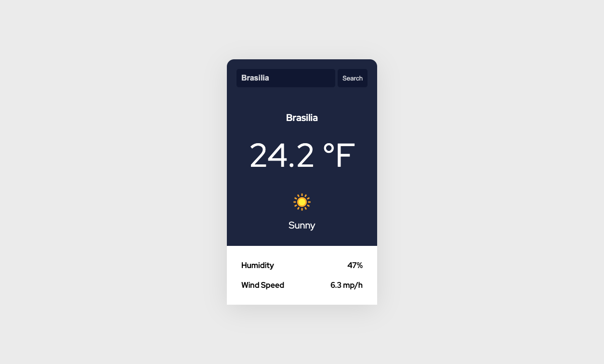

# 🚀 App Weather Forecast


A simple weather forecast application created for studying purposes, and to practice JavaScript and API integration using the [Free Weather API](https://www.weatherapi.com/).

---

## 📚 Table of Contents

- [🚀 App Weather Forecast](#-app-weather-forecast)
  - [📚 Table of Contents](#-table-of-contents)
  - [📝 About](#-about)
  - [✨ Features](#-features)
  - [🧰 Tech Stack](#-tech-stack)
    - [📦 Core Technologies](#-core-technologies)
  - [🏗️ Architecture](#️-architecture)
  - [🖼️ Screenshots](#️-screenshots)
  - [🚀 Getting Started](#-getting-started)
    - [📋 Prerequisites](#-prerequisites)
    - [🔧 Installation](#-installation)
  - [📁 Folder Structure](#-folder-structure)
  - [🎯 What I Learned](#-what-i-learned)
  - [🤝 Contributing](#-contributing)
  - [📄 License](#-license)
  - [📬 Contact](#-contact)

---

## 📝 About

This project is a weather forecast application that allows users to search for current weather conditions and forecasts for any location worldwide. It utilizes the Free Weather API to fetch real-time weather data and displays it in a user-friendly interface.

---

## ✨ Features

- 🌍 Search for weather by city
- 📱 Responsive design for mobile and desktop
- 🌤️ Current weather conditions
- 💧 Humidity and wind speed numbers
- 🔐 Server side API Handling with Node.js and Express.js

---

## 🧰 Tech Stack

### 📦 Core Technologies

[](https://skillicons.dev)

- **Frontend:** HTML / CSS / JavaScript
- **Backend:** Node.js / Express.js 
- **Tools & DevOps:** Git / GitHub / Dotenv / Axios / Fetch API

---

## 🏗️ Architecture

- Clean Code principles
- Responsive design
- Server-side API handling
- Environment variables for API Key
- Async/Await for asynchronous operations

---

## 🖼️ Screenshots



---

## 🚀 Getting Started

### 📋 Prerequisites

- Node.js >= 18.x
- npm or yarn
- Git

### 🔧 Installation

1. Clone the repository
```bash
git clone git@github.com:Fransuelton/app-weather-forecast.git
````

2. Navigate to the backend folder
```bash
cd app-weather-forecast/backend
````

3. Install backend dependencies
```bash
npm install
````

4. Create your environment file
```bash
cp .env.example .env
```

✍️ Open the .env file and replace the placeholder with your [WeatherAPI](https://www.weatherapi.com/) key:
```env
API_KEY=your_api_key_here
```

5. Start the backend server
```bash
node index.js
```

6. Open a new terminal and navigate to the frontend folder
```bash
cd ../frontend
```

💡 You can open index.html directly in the browser or use a development server like Live Server (VS Code extension) for hot reload.

✅ Result

The backend will be running at:

```bash
http://localhost:3000
```
And your frontend will fetch weather data using:

```bash
GET /api/clima?city=YourCity
```

---

## 📁 Folder Structure

```bash
app-weather-forecast/
├── .github/
├── backend/
│   ├── .env.example
│   ├── index.js
│   ├── package.json
│   ├── package-lock.json
├── frontend/
│   ├── src/
│   │   ├── css/
│   │   │   ├── font.css
│   │   │   ├── reset.css
│   │   │   ├── style.css
│   │   ├── js/
│   │   │   ├── index.js
├── .gitignore
├── index.html
└── README.md
```

---

## 🎯 What I Learned

During the development of this project, I gained important knowledge in areas that are crucial for building secure and maintainable web applications:

- 🔐 How to protect API keys by using a simple Node.js proxy server, even in frontend-only projects  
- 🛡️ The risks of exposing sensitive information in public repositories  
- 🧹 How to safely remove an API key from a Git repository history using Git tools (`git filter-branch`, `.gitignore`, etc.)  
- 🌍 The importance of environment variables for separating configuration from code

---

## 🤝 Contributing

We welcome contributions! Here's how to get started:

```bash
# Fork the project
# Create a new branch
git checkout -b feature/amazing-feature

# Make your changes
# Commit your changes
git commit -m "feat: add amazing feature"

# Push to your fork
git push origin feature/amazing-feature

# Open a Pull Request
```

---

## 📄 License

This project is licensed under the MIT License. See the [LICENSE](./LICENSE) file for details.

---

## 📬 Contact

**Fransuelton Francisco**  
📫 contato@fransuelton.dev  
🌐 [fransuelton.dev](https://fransuelton.dev)  
🐙 [github.com/Fransuelton](https://github.com/Fransuelton)  
💼 [linkedin.com/in/fransuelton](https://www.linkedin.com/in/fransuelton)

---

⭐️ If you found this project useful, please consider leaving a star!